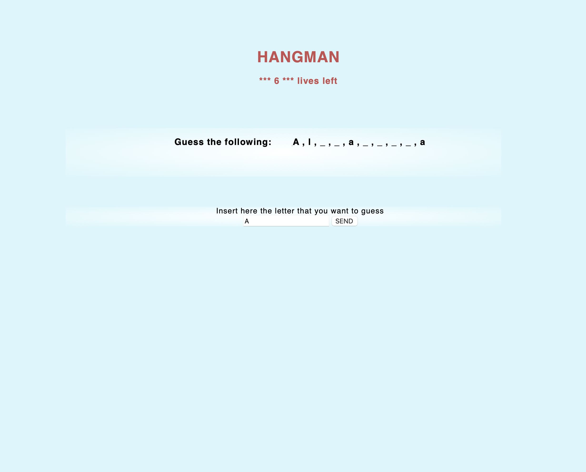

# Hangman

<figure style="text-align: center;">
    <picture>
        
    </picture>
    <figcaption>Screen shot of the app showing the word to be quess and a form 
for inserting the letters you supose the word have.</figcaption>
</figure>

## Description

A practice web app that is asking user to guess a single word, the autor implemented in the app.

## How to run

To run the application, download the files to your local machine and 
open the "index.html" file in your favorite web browser.

## Usage

The user is greeted with a letter placeholder, where the letters are replaced by underscores and separated by commas. Also a form is provided for the user to input a character they want to guess. If the guess is correct, the character will appear in the placeholder. If the guess is incorrect, the user will lose one life. Each game starts with 7 lives. However, refreshing the page will reset all data.

Enjoy!

#

The content of this repository is licensed under a [Creative Commons 
Attribution License.](https://creativecommons.org/licenses/by/4.0/deed.en)

